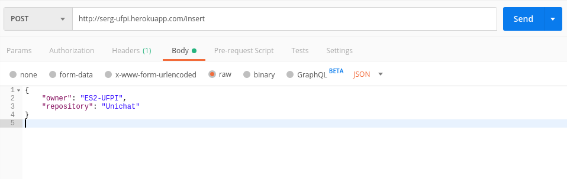

# Ferramenta para coleta e persistência de dados de repositórios de software

## Requisitos
* Ter o python na em versão >= 3.6
* Instale os módulos que estão no arquivo requirements.txt com o comando abaixo:

```sh
pip install -r requirements.txt
```

## API
A ferramenta em questão pode ser utilizada publicamente através do url [serg-ufpi.herokuapp.com](http://serg-ufpi.herokuapp.com)

### Headers
Para utilização da API é necessário que nos headers sejam passadas as seguintes informações
* `Content-Type: application/json`

### A api possui os seguintes endpoints no momento
* `/insert`
  * Tipo do método: POST
  * Informações no body (json):
    * owner: Nome do dono do repositório
    * repository: Nome do repositório

* `/commits`
  * Tipo do método: GET
  * Informações no body (json):
    * owner: Nome do dono do repositório
    * repository: Nome do repositório
    * limit(opcional): Limite de número de commits que devem ser retornados

* `/issues`
  * Tipo do método: GET
  * Informações no body (json):
    * owner: Nome do dono do repositório
    * repository: Nome do repositório
    * limit(opcional): Limite de número de issues que devem ser retornados

* `/pullrequests`
  * Tipo do método: GET
  * Informações no body (json):
    * owner: Nome do dono do repositório
    * repository: Nome do repositório
    * limit(opcional): Limite de número de pullrequests que devem ser retornados

### Utilização da API
Para esse exemplo iremos utilizar um software próprio para realizar requisições chamado Postman que pode ser obtido clicando [aqui](https://www.getpostman.com/downloads/).

Com o Postman instalado, podemos começar.



Selecione o método `POST`

Digite o endpoint logo no campo a direita, no caso `http://serg-ufpi.herokuapp.com/insert`.

Selecione a guia `Body`, e logo depois selecione o check `raw` e ao final da linha mude para `JSON`.

Tendo feito isso coloque os campos necessários de acordo com o endpoint escolhido. No nosso caso:

```json
{
	"owner": "ES2-UFPI",
	"repository": "Unichat"
}
```

Ao final, basta clicar no botão `Send` em azul e aguardar a resposta da sua requisição. No caso de inserção de dados, pode demorar um pouco dependendo do número de informações no repositório que for passado no Json.


